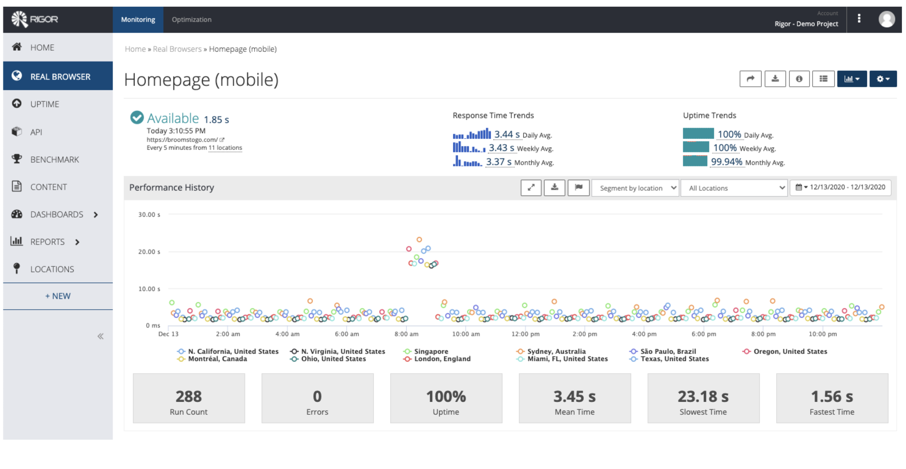

# Rigor Demo

### Outline
* Follow Demo Pre-Work [here](README.md)
* Show an analyzed website
* Show a video and metrics of the simulated user transaction
* See a detailed waterfall view of the transaction
* Analyze the transaction for optimization opportunities, with resolutions

### Demo Steps

**See**.......|**Do**...............................|**Say**.............................................
-----|----|-----------------------
|Navigate to page from [Pre-work](README.md)|Rigor Monitoring provides 24/7 insight into how users experience your web application while proactively alerting on any outage or performance degradation.  Our Real Browser checks are running in the latest version of Chrome to provide data across the globe for both your desktop and mobile users.  These checks collect data in order to baseline performance and understand daily, weekly, monthly patterns of performance.  They can also identify the root cause of why a page is performing poorly.  For example, we can see this collection of data points where we identify performance regression.  If we click into this data point (outlier created by rule), a user can dive into detail about where this performance regression came from.
|Click on one of the outliers|Within the data from our Real Browser Check, Rigor provides several important metrics that customers can use to understand exactly what the user experience was in this instance. (Depending on audience, can focus/discuss particular metrics).
|Click to play filmstrip video|Rigor provides filmstrips/videos to reproduce the user experience to visualize the issue. For instance, here you can see that the user experience was horrible due to this painful visual of this image taking forever to load.
|Scroll down to the waterfall chart  Draw attention to the long bar (image load)|For each page in the user flow, a waterfall chart is provided where we can locate the resource or resources that created the regression.  As you can see here, an image took a substantial time to load, pushing out VC/Loaded time, ultimately creating very poor user experience.  Now that we have identified the issue, most of our customers ask “Why did this happen?  What do I do now?”.  
|Scroll up to the Optimization Analysis section, and click on the link|This is where Rigor goes a step further to give you an actual solution to the problem identified, this is completely unique to Rigor
|&nbsp;|At this point Rigor runs through over 300 performance best practices to identify defects within your web application that could be leading to performance related issues.
|Click on the Best Practices Score|In this provided list of defects, we break down defects for specific roles within the organization (Developer, Designer, Ops) and list all defects according to severity. We can also adjust thresholds and severity to fit with your organization's performance budgets and strategy. If we remember that large image we saw a minute ago, we’ve actually captured it as a severe defect.
|Click on the JPEG Candidate Image|For each defect present, we not only give you detailed analysis as to why we should care about the issue, but we also take things a step further by showing you how to resolve it. We go even further and actually GIVE you the solution.
|Click into unoptimized image|As you can see, we are provided with the unoptimized version of the image that was causing the incredibly slow load times.
&nbsp;|Move the curso over the image left-to-right|We can optimize this image with no visual changes and provide you with the optimized version.
&nbsp;|Click to Download optimized image|You can even download it straight off the platform. This helps organizations by minimizing time to resolution for these issues all while providing a single, automated source of truth for your performance gaps.
